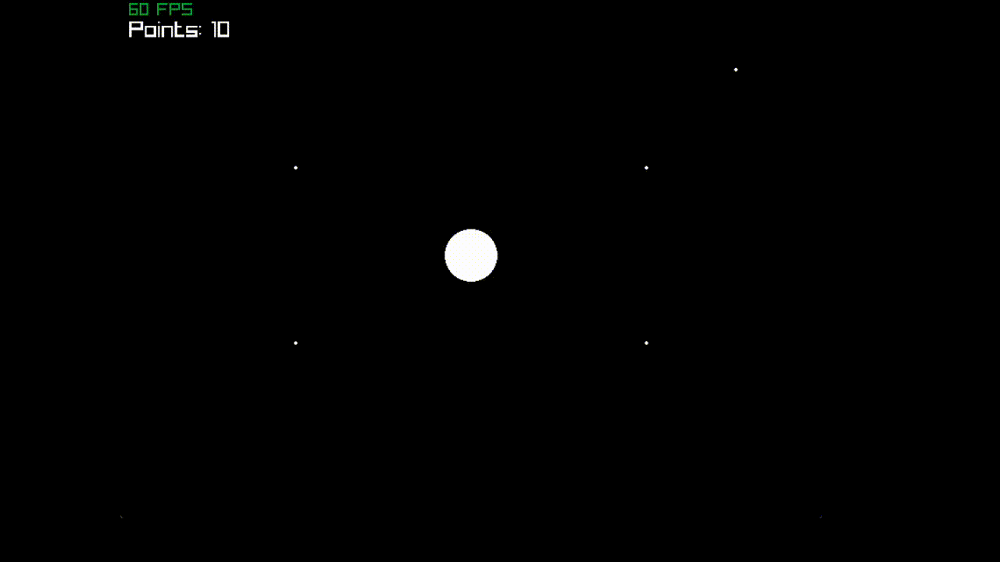

# 3C >> Circle Chasing Circle

This game was made in raylib using the GNU Assembler (GAS)
Only works for x86_64 and Linux (I'm gonna work on cross-platfrom, don't you worry)
This game was mostly to test and use my Assembly knowledge but it grew to this. Expect errors.

# HOW TO BUILD!! (Linux and POSSIBLY WSL2 and MAYBE MacOS compatible)

1. go to the game directory
2. make a folder called `build` (`mkdir build`)
3. go to that directory using `cd build`
4. type `cmake ..` and let it to its thing
5. when it's finished, type `make && ./3C`
6. enjoy!

full comand line:
```
> mkdir build && cd build

> cmake ..
< A few lines of text >
> make && ./3C
< game init & raylib tracelogs >
```

[here's a "Cheat Sheet" for assembly](https://www.cs.uaf.edu/2017/fall/cs301/reference/x86_64.html)

# community:
[Discord](https://discord.gg/J8EVht6MkB) (I know this is for GLASS -- Graphics Library in ASSembly, I promise this isn't some marketing stunt or anything like that)
